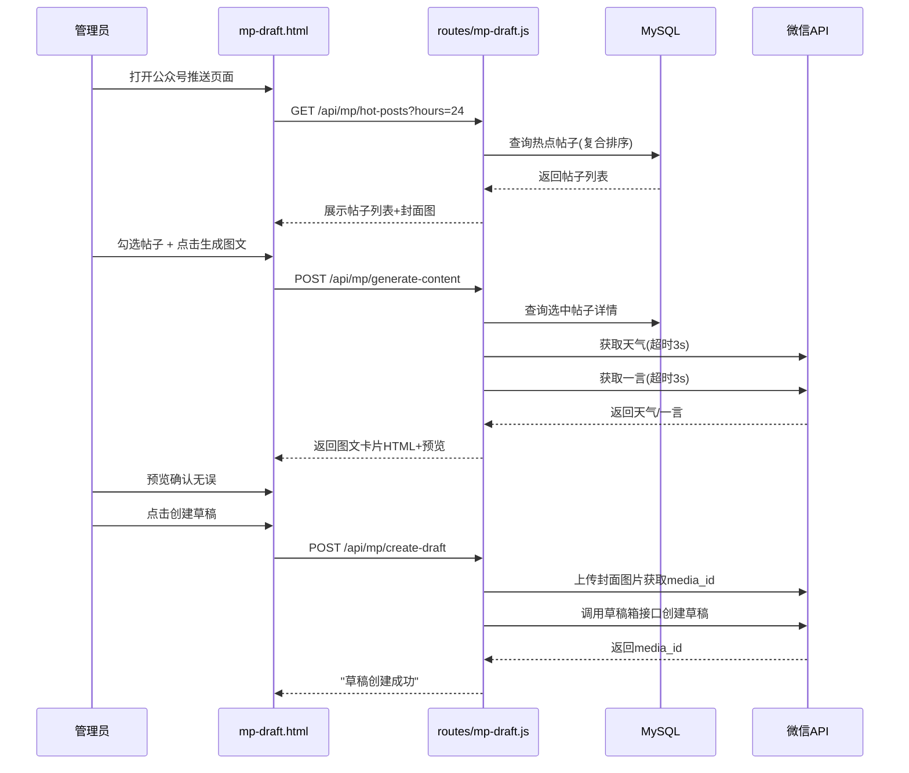

## 产品概述

在管理员后台新增"公众号推送"功能模块，实现将站内精选的热门帖子一键生成精美的微信公众号图文卡片，并创建为公众号草稿，供运营者在公众号后台审核发布。

## 核心功能

- 管理后台侧边栏新增"公众号推送"入口，点击跳转到独立的推送管理页面
- 查看近N小时内的热点帖子列表（按点赞、评论、浏览热度排序，含封面图）
- 支持勾选多个帖子，一键生成精美图文卡片（含天气卡片、一言卡片、帖子排行等）
- 实时预览生成的图文内容效果
- 一键创建微信公众号草稿
- 一键发布"今日精选"（自动获取热点帖子+天气+一言+生成卡片+创建草稿）
- 查看已创建的草稿列表，支持删除草稿

## 技术栈

- 框架：Node.js + Express（现有项目）
- 数据库：MySQL（现有连接池 pool）
- 前端：纯 HTML + CSS + JavaScript（与管理后台风格一致）
- 微信API：通过 `services/mp-draft.js` 调用公众号草稿箱接口

## 实现方案

采用A方案：使用独立路由文件 `routes/mp-draft.js`，在 `server.js` 注册到 `/api/mp` 路径，同时清理 `routes/admin.js` 中的重复路由。

前端新建独立页面 `views/admin/mp-draft.html`，通过侧边栏链接跳转访问，页面内全部使用纯JavaScript（无框架），与管理后台 `admin/index.html` 的设计风格保持一致。

### 核心架构图



### 模块划分

- **路由模块** `routes/mp-draft.js`：处理所有推送相关API请求（已存在，无需修改）
- **服务模块** `services/mp-draft.js`：封装微信公众号API调用（已存在且完整）
- **前端页面** `views/admin/mp-draft.html`：新建，包含完整的推送管理UI
- **侧边栏** `views/admin/index.html`：新增一个外部链接跳转到推送页面

### 实现注意事项

- **性能**：热点帖子查询使用复合排序（点赞*2+评论*3+浏览*0.1），控制在10条以内；天气/一言API调用已带3秒超时，失败返回null不影响主流程
- **日志**：复用现有 `[MP素材]` 日志前缀，不记录完整access_token
- **安全性**：所有推送接口已带 `auth` + `isStaff` 中间件
- **兼容性**：不修改admin/index.html的任何现有功能逻辑，仅新增一个侧边栏链接；新页面 `mp-draft.html` 复用admin的Auth Token验证方式（从localStorage读取）

### 目录结构

```
project-root/
├── server.js                                      # [MODIFY] 注册 /api/mp 路由 + /admin/mp-draft 页面路由
├── routes/
│   ├── mp-draft.js                                # [USE] 已有且完整，无需修改
│   └── admin.js                                   # [MODIFY] 删除重复的 mp-draft 路由（第1837-2023行）
├── views/admin/
│   ├── index.html                                 # [MODIFY] 侧边栏新增"公众号推送"链接
│   └── mp-draft.html                              # [NEW] 完整的公众号推送管理页面
├── upload.js                                      # [MODIFY] 添加新文件到上传列表
```

### 修改点详解

#### 1. server.js — 路由注册

在API路由区域（约第55行附近）添加：

```
app.use('/api/mp', require('./routes/mp-draft'));
```

在HTML视图路由区域（约第316行附近）添加：

```
app.get('/admin/mp-draft', (req, res) => {
  res.sendFile(path.join(__dirname, 'views', 'admin', 'mp-draft.html'));
});
```

#### 2. routes/admin.js — 清理重复路由

删除第1837行到第2023行（`// ===== 推送卡片生成` 到 `module.exports = router;` 之前的所有内容），包括：

- `const mpDraftService = require('../services/mp-draft');`
- 所有 `/mp/*` 路由（hot-posts, extra-info, generate-content, create-draft, publish-daily）
- `generateCardHTML` 函数

#### 3. views/admin/mp-draft.html — 新建页面

完整功能页面，包含：

- 顶部导航栏：返回admin入口，页面标题"公众号推送"
- Tab页切换：帖子选择 / 图文预览 / 草稿管理
- **帖子选择Tab**：时间范围选择器 + 刷新按钮 + 帖子列表（带勾选框和封面缩略图）
- **图文预览Tab**：天气/一言开关 + 预览iframe/div + 操作按钮（生成、创建草稿、一键发布）
- **草稿管理Tab**：草稿列表（media_id、标题、创建时间）+ 删除按钮
- 底部：状态信息栏

#### 4. views/admin/index.html — 侧边栏链接

在"系统管理"section末尾、"微信测试"链接之后添加新section：

```html
<div class="nav-section">
    <div class="nav-section-title">运营工具</div>
    <a href="/admin/mp-draft" class="sidebar-link" target="_self" data-title="公众号推送">
        <span class="link-icon">
            <svg><!-- 公众号推送图标 --></svg>
        </span>
        <span class="link-text">公众号推送</span>
    </a>
</div>
```

#### 5. upload.js — 上传列表

在 FILES 数组中添加：

- `'routes/mp-draft.js'`
- `'views/admin/mp-draft.html'`