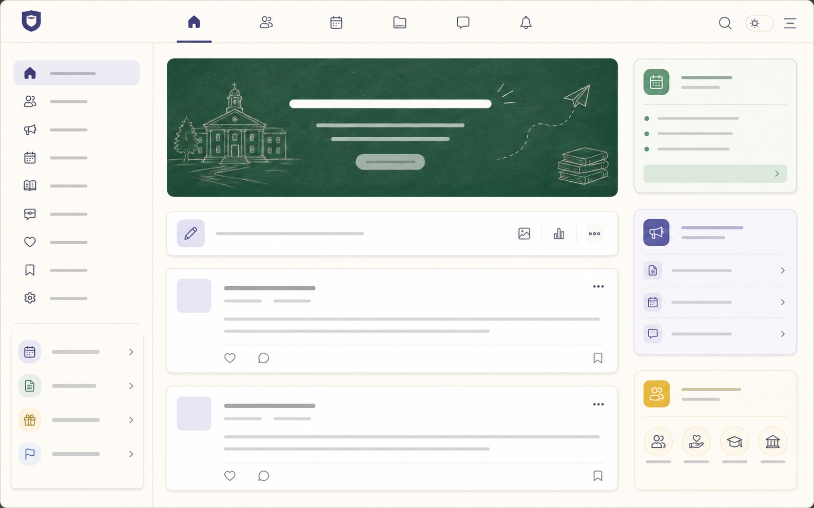
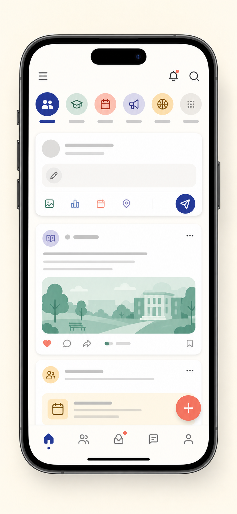
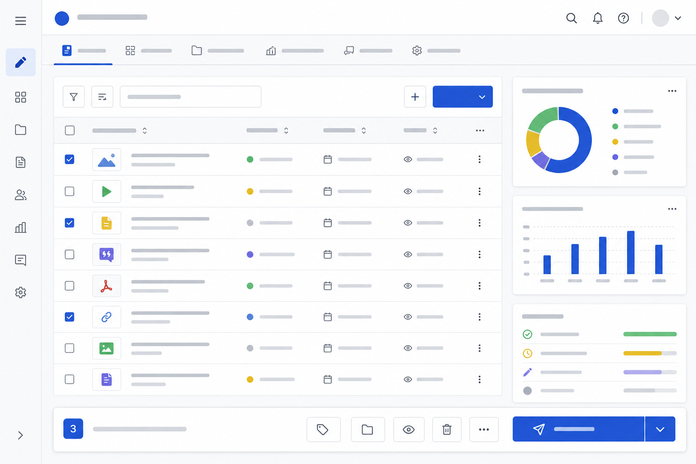
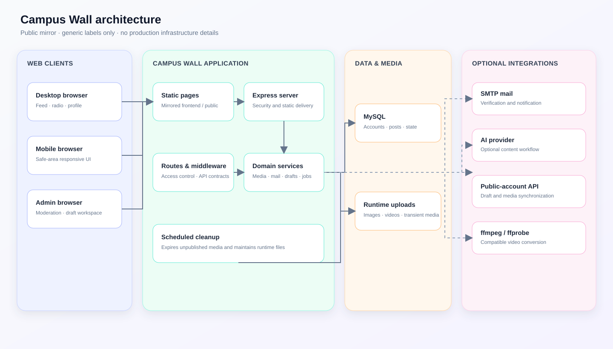

# Campus Wall

[](https://github.com/Jay071023/school_wall/actions/workflows/ci.yml)

> 把校园里最常见的事——表达、回应、点歌和运营——收进一个能真正运行的社区系统。

Campus Wall 是一个可自托管的校园社区 Web 应用。它不是只展示信息流的页面模板，而是覆盖投稿、互动、私信、点歌、内容审核、公众号草稿和站点运营的一套完整闭环。后端使用 Node.js + Express，前端使用原生 HTML、CSS 和 JavaScript，适合希望保留自主可控能力的校园社群、学生组织或小型内容社区。

> 这是公开的**脱敏镜像**：不包含生产数据库、真实用户内容、上传媒体、日志、服务器地址、第三方凭据或运维配置。它不会连接或部署到生产环境。

## 先看产品

| 社区首页 | 移动端体验 | 运营工作台 |
| --- | --- | --- |
|  |  |  |

所有图片都是脱敏示意图，不含真实学校、用户或投稿内容。

## 它解决什么

- **让表达有去处**：发帖、评论、点赞、收藏、匿名选择、个人主页和私信组成完整互动链路。
- **让运营不靠手工拼凑**：后台集中处理内容审核、通知、站点设置、点歌排期和公众号草稿。
- **让移动端不是桌面的缩小版**：首页、卡片、广播站和后台均按 `768px/769px` 响应式边界维护。
- **让媒体可以安全流动**：帖子支持最多 9 张图片或 1 个视频；未发布媒体会清理，已发布媒体保留引用关系。
- **让视觉有连续性**：主题在首屏就绪后再释放页面，避免慢网络下出现未加载主题的闪屏。

## 校墙的原创实现

本仓库中的业务代码、页面组织和以下工作流由校墙项目自行设计与实现。这里展示的是可复用的工程思路，未包含任何真实校园数据。

| 设计 | 它解决的问题 |
| --- | --- |
| `frontend/` 与 `public/` 双静态树镜像检查 | 同一套页面可由不同运行入口稳定提供，避免只改一边造成线上表现不一致。 |
| 从投稿视频到公众号草稿的媒体链路 | 原站视频保持不变；公众号侧使用兼容转换和文章链接兜底，避免内容二次同步丢失。 |
| 点歌排期与运营草稿工作台 | 将用户点歌、时段管理、审核与运营发布放进连续流程，而不是散落在多个表单。 |
| 首屏主题门控 | 页面等待主题状态确认后再显示，减少节日主题和常规主题切换时的视觉闪烁。 |
| 公开脱敏镜像工作流 | 用公开代码、示意图和环境模板支持协作，同时把生产数据、凭据和运维边界隔离在镜像外。 |

## Quick start

需要 Node.js 20+ 和 MySQL 8+。在 PowerShell 中执行：

```powershell
npm install
Copy-Item .env.example .env
npm start
```

服务默认运行在 `http://localhost:3000`，健康检查为 `GET /api/health`。将 `.env` 中的 MySQL 参数与 `JWT_SECRET` 替换为本地值；不要提交 `.env`、上传目录、日志或数据库文件。

## 配置边界

| Variable | Required | Purpose |
| --- | --- | --- |
| `DB_HOST`, `DB_USER`, `DB_PASSWORD`, `DB_NAME` | Yes | MySQL connection |
| `JWT_SECRET` | Yes | Session signing secret |
| `GLM_API_KEY` | Optional | AI text and image capability |
| `WECHAT_APPID`, `WECHAT_TOKEN` | Optional | Public-account and OAuth integration |
| `FFMPEG_PATH`, `FFPROBE_PATH` | Optional | Override video conversion tools |

`config/auto-publish.json` 和内置故事配置均为无生产数据的示例，自动发布默认关闭。

## 架构与目录



可编辑图源见 [docs/public/architecture.mmd](docs/public/architecture.mmd)。它只描述公开版的通用边界，不包含生产端点和基础设施。

```text
frontend/ and public/  镜像静态页面树
routes/                HTTP 接口与权限控制
services/              邮件、媒体、AI、通知与草稿工作流
middleware/            认证与请求公共层
config/                本地配置模板与数据库访问
scripts/               聚焦的静态和行为检查
docs/                  代码地图、架构与协作文档
```

修改 `frontend/` 的 HTML、页面 JavaScript 或 CSS 时，必须同步 `public/`；`npm run check:mirrors` 会验证这一约定。

## 验证

```powershell
npm run check:mirrors
npm run check:privacy
npm run check:deployment
npm test
git diff --check
```

GitHub Actions 会在 `main` 推送和 Pull Request 上执行同一组公开版检查。

## 一起完善它

欢迎提交能让校园社区更好用的改进：无障碍体验、移动端细节、审核工具、内容工作流、测试覆盖和脱敏的文档示例都很有价值。

提交前请阅读 [CONTRIBUTING.md](CONTRIBUTING.md)。Issue 和 Pull Request 模板已经要求说明复现、行为变化和实际验证。安全问题请走 [SECURITY.md](SECURITY.md) 的私密反馈流程，不要公开漏洞细节。

## 许可证与署名

代码以 [Apache-2.0](LICENSE) 发布，版权所有 `Copyright 2026 Jay071023`。二次分发或衍生项目必须保留 [LICENSE](LICENSE) 和 [NOTICE](NOTICE) 中与本项目相关的版权及归属声明。

论文、文章、产品介绍或衍生项目的说明页请标注：`Campus Wall · developed by Jay071023`，并链接到本仓库。GitHub 会从 [CITATION.cff](CITATION.cff) 提供标准引用信息。

## 公开镜像边界

- 不提交真实投稿、用户资料、上传媒体、日志、备份、私有地址或凭据。
- 所有集成参数都是占位示例；真实值只放在本地环境变量或私有部署配置中。
- 本仓库不会自动发布到生产服务；Pull Request 只代表公开源码审查。
