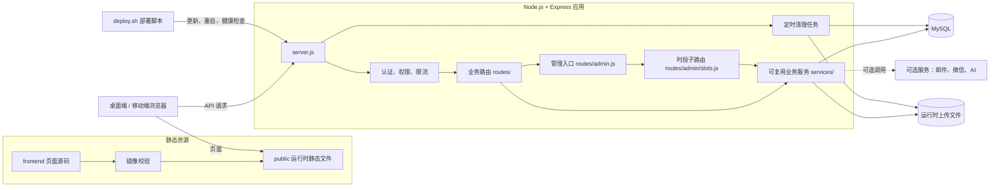

# 校墙 · Campus Wall

<p align="center">
  <strong>把表达、回应、点歌与内容运营，收进一个真正能落地的校园社区。</strong>
</p>

<p align="center">
  <a href="https://github.com/Jay071023/school_wall/stargazers"></a>
  <a href="https://github.com/Jay071023/school_wall/actions/workflows/ci.yml"></a>
  <a href="LICENSE"></a>
  <a href="https://github.com/Jay071023/school_wall"></a>
</p>

> 如果它对你的校园社群有帮助，欢迎点一个 **Star**。你的关注会让这个公开项目持续被维护、被看见。

校墙是一个可自托管的校园社区 Web 应用。它不是单页信息流模板：从投稿、互动、匿名选择、私信、点歌，到内容审核、公众号草稿和站点运营，代码围绕真实的使用链路组织。前端坚持原生 HTML / CSS / JavaScript，后端使用 Node.js + Express，数据库为 MySQL，适合学生组织、校园媒体、兴趣社群和小型内容团队二次部署。

> [!IMPORTANT]
> 这里是**公开脱敏镜像**。不含真实学校、用户、投稿、上传媒体、日志、服务器地址、第三方凭据或生产运维配置。它可用于本地搭建、学习和协作，不能直接连接原项目的生产服务。

## 先看它长什么样

| 社区首页 | 移动端 | 运营工作台 |
| :---: | :---: | :---: |
|  |  |  |
| 内容流、互动卡片与侧栏信息 | 为拇指操作重新排布，而非缩小桌面页 | 审核、点歌、发布和站点设置集中处理 |

截图均为脱敏示意，不含真实学校、用户或投稿内容。

## 为什么做校墙

校园里的内容并不只是一条帖子。有人想匿名说一句话，有人想在评论里被回应，有人想点一首歌，也有人要审核内容、排期、通知和把合适的素材整理到公众号。把这些环节拆到多个工具里，运营会很快变成反复复制、截图和对表。

校墙想解决的就是这件事：

- **给表达一个完整去处**：发帖、评论、点赞、收藏、匿名、个人资料和私信在同一个账号体系里协作。
- **给运营一条连续链路**：审核、点歌时段、预约、通知、公众号草稿和站点设置集中在后台，不靠手工拼接多个表格。
- **让移动端成为一等公民**：不是把桌面卡片压窄，而是对布局、可点击区域、溢出和安全区单独处理。
- **让公开协作不伤害真实服务**：以脱敏源码、示意图和环境模板公开项目，同时隔离真实内容、凭据与生产基础设施。

## 功能一览

| 面向谁 | 能做什么 | 实现位置 |
| --- | --- | --- |
| 学生与访客 | 发帖、图片或视频投稿、匿名选择、评论、点赞、收藏、个人主页 | `frontend/`、`routes/posts.js`、`routes/upload.js` |
| 社群成员 | 私信、关注、通知、签到、头衔与积分 | `routes/messages.js`、`routes/follows.js`、`routes/notifications.js` |
| 点歌用户 | 浏览广播站、提交点歌、查看排期与预约 | `frontend/radio.html`、`routes/songs.js`、`routes/reservations.js` |
| 审核与运营人员 | 内容审核、用户角色、通知、公告、点歌时段、后台设置 | `frontend/admin/`、`routes/admin.js` |
| 公众号运营人员 | 从热点内容生成图文预览和草稿，同步时保留媒体处理结果与失败反馈 | `frontend/admin/mp-draft.html`、`routes/mp-draft.js` |
| 部署维护者 | 健康检查、静态镜像校验、隐私检查、聚焦行为测试 | `routes/health.js`、`scripts/` |

### 做得不止“能用”的地方

| 设计 | 为什么这样实现 |
| --- | --- |
| `frontend/` 与 `public/` 双静态树 | Node 服务和独立静态入口都能提供同一页面。镜像检查防止只改一边、线上两套表现不一致。 |
| 首屏主题门控 | 先确认主题状态再显示页面，避免节日主题在慢网络下先闪出普通样式。 |
| 帖子视频到公众号草稿的链路 | 站内原视频不被改写；同步端按兼容格式处理并保留原帖入口，降低二次发布丢内容的概率。 |
| 点歌排期工作流 | 把时段、日期、审核、播放状态和预约写进有约束的业务流程，避免“能提交但没有归宿”。 |
| 未发布媒体清理 | 图片和视频在未发布状态下按规则回收，已通过的帖子维持引用，兼顾空间和内容完整性。 |
| 权限放在服务端 | 页面入口只是体验层，路由和中间件仍是角色与敏感操作的实际边界。 |

这些业务代码、页面组织和工程约定由校墙项目自行设计与实现；公开版展示可复用思路，不公开真实校园数据。

## 技术实现与架构




| 层次 | 技术与职责 |
| --- | --- |
| 页面层 | 原生 HTML、CSS、JavaScript；`frontend/` 与 `public/` 保持镜像；`768px` 及以下为移动布局。 |
| 服务层 | Node.js 20+、Express、Helmet、限流、压缩、Cookie 与 JWT。 |
| 业务层 | `routes/` 定义 HTTP 契约和权限入口，`services/` 处理邮件、AI、媒体、清理、公众号草稿等领域逻辑。 |
| 数据层 | MySQL 8+；首次初始化自动创建数据库和业务表，启动过程也会做兼容字段迁移。 |
| 文件层 | 图片与视频以运行时上传目录保存；定时任务清理未发布且超过保留期的媒体。 |
| 可选集成 | SMTP 邮件、智谱 GLM、微信公众号接口、`ffmpeg` / `ffprobe`；不配置时只影响对应能力。 |

更细的入口和关联关系见 [代码索引](docs/PROJECT_INDEX.md)。

## 从零开始本地搭建

以下流程对应当前公开版源码。完成后可访问完整的本地站点、注册普通用户，并创建首位超级管理员。

### 1. 准备环境

- [Node.js](https://nodejs.org/) **20 或更高版本**
- MySQL **8 或更高版本**，并准备一个可创建数据库和表的本地账号
- Windows、macOS 或 Linux 均可；下面命令以 PowerShell 为例

### 2. 克隆并安装依赖

```powershell
git clone https://github.com/Jay071023/school_wall.git
Set-Location school_wall
npm ci
Copy-Item .env.example .env
```

### 3. 填写最小配置

打开 `.env`，至少填好 MySQL 和下列两项管理员配置：

```dotenv
DB_HOST=localhost
DB_PORT=3306
DB_USER=你的 MySQL 用户名
DB_PASSWORD=你的 MySQL 密码
DB_NAME=campus_wall

# 用每个部署实例自己的随机值替换；不要复用示例或提交到 Git。
JWT_SECRET=替换为至少 32 字符的随机密钥

INITIAL_ADMIN_USERNAME=wall_admin
INITIAL_ADMIN_PASSWORD=替换为至少 12 位的管理员密码
INITIAL_ADMIN_NICKNAME=站点管理员
```

可用以下命令生成 `JWT_SECRET`：

```powershell
node -e "console.log(require('crypto').randomBytes(48).toString('base64url'))"
```

### 4. 初始化数据库与首位管理员

```powershell
npm run bootstrap:admin
```

该命令会创建缺失的数据库和表，然后创建一个 `super_admin`。它**不会**在普通 `npm start` 时悄悄创建管理员，也**不会**修改同名的已有账号；若账号已存在会直接停止并说明原因。

### 5. 启动与核对

```powershell
npm start
Invoke-RestMethod http://localhost:3000/api/health
```

看到 `{ code: 200, status: 'ok' }` 后，打开：

- 社区首页：<http://localhost:3000>
- 登录页：<http://localhost:3000/login>
- 管理后台：<http://localhost:3000/admin>

使用第 3 步设置的管理员账号登录即可。不要直接用 `file://` 打开 HTML：页面需要 Node 服务和 MySQL 提供 API。

### 搭建结果与边界

| 项目 | 结果 |
| --- | --- |
| 数据库与基础表 | `npm run bootstrap:admin` / `npm start` 均会调用初始化逻辑创建缺失结构。 |
| 首位超级管理员 | 仅 `npm run bootstrap:admin` 在明确填写配置后创建，且不覆盖同名账号。 |
| 社区、账号、帖子、点歌、后台 | 使用本地 MySQL 和本地上传目录运行。 |
| 邮件、AI、微信公众号、视频转码 | 需要额外配置相应凭据或工具；未配置时不应把它们当作已启用能力。 |
| 生产部署 | 本公开镜像不携带生产部署配置。上线前需自行设置 HTTPS、域名、备份、进程守护与私有环境变量。 |

## 配置说明

| 配置 | 是否必填 | 用途 |
| --- | :---: | --- |
| `DB_HOST`、`DB_PORT`、`DB_USER`、`DB_PASSWORD`、`DB_NAME` | 是 | MySQL 连接与数据库名称。 |
| `JWT_SECRET` | 是 | 登录令牌签名密钥，必须为部署实例独有的随机值。 |
| `INITIAL_ADMIN_*` | 仅首次初始化 | 创建首位管理员；创建成功后可从 `.env` 删除密码值。 |
| `PORT`、`HOST` | 否 | 默认 `3000` 与 `0.0.0.0`。 |
| `ALLOWED_ORIGINS`、`SITE_URL`、`PUBLIC_WALL_ORIGIN` | 部署域名时建议 | 跨域、邮件链接、公众号内容中的站点地址。 |
| `GLM_API_KEY` | 否 | 启用 AI 文本或图像能力。 |
| `WECHAT_*`、`MP_DEFAULT_THUMB_MEDIA_ID` | 否 | 微信登录、回调、模板消息和公众号草稿。 |
| `SMTP_*` | 否 | 邮箱验证码与通知邮件。 |
| `FFMPEG_PATH`、`FFPROBE_PATH` | 否 | 为公众号侧的视频兼容处理指定工具路径。 |

完整占位项见 [.env.example](.env.example)。`.env`、`.env.local`、上传文件、日志与数据库文件都已在 `.gitignore` 中排除，仍请在提交前自行检查 `git diff`。

## 开发、验证与贡献

```powershell
# 页面镜像、公开版隐私边界、部署静态约定与全部行为测试
npm run check:mirrors
npm run check:privacy
npm run check:deployment
npm test
git diff --check
```

GitHub Actions 会在每次推送 `main` 和每个 Pull Request 上运行同一组公开版检查。修改 HTML、页面 JavaScript 或 CSS 时，务必同步 `frontend/` 与 `public/`，并在桌面端、移动端以及 `768px / 769px` 边界检查卡片、溢出、加载、空状态、错误状态和权限状态。

欢迎从这些方向参与：移动端体验、无障碍、审核工具、内容工作流、测试覆盖和脱敏示例。提交前请阅读 [贡献指南](CONTRIBUTING.md)；安全问题请依照 [安全策略](SECURITY.md) 私密反馈，不要在公开 Issue 中附上漏洞细节、真实内容或凭据。

## 许可证、署名与引用

代码以 [Apache-2.0](LICENSE) 发布，版权所有 `Copyright 2026 Jay071023`。二次分发或衍生项目必须保留 [LICENSE](LICENSE) 与 [NOTICE](NOTICE) 中的版权和归属声明。

如果你在论文、文章、产品介绍或衍生项目中使用校墙，请标注：

> `Campus Wall · developed by Jay071023`<br>
> <https://github.com/Jay071023/school_wall>

GitHub 可从 [CITATION.cff](CITATION.cff) 生成标准引用信息。欢迎 Star、Fork、提出想法，也欢迎把你的二次开发成果带回来交流。

## 公开镜像边界

- 不提交真实投稿、用户资料、上传媒体、日志、备份、私有地址或任何凭据。
- 所有第三方参数都是占位示例；真实值只放进本地环境变量或私有部署配置。
- 本仓库的 CI 只验证公开源码，不会发布 npm 包，也不会部署任何生产服务。
